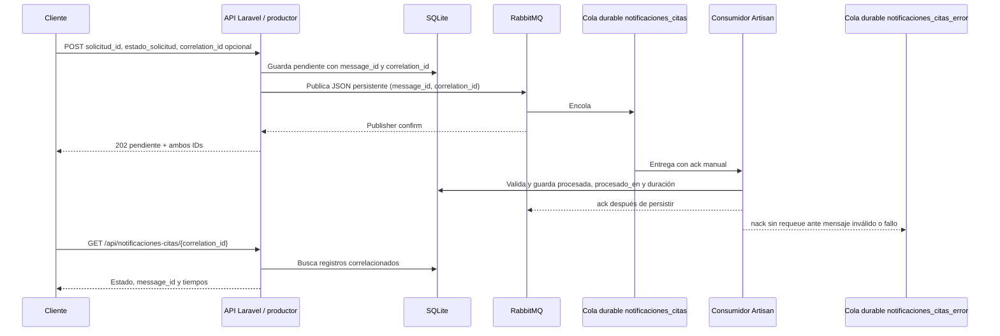

# Flujo asíncrono de notificaciones de citas

```mermaid
sequenceDiagram
    participant Cliente
    participant API as API Laravel / productor
    participant DB as SQLite
    participant Broker as RabbitMQ
    participant Cola as Cola durable notificaciones_citas
    participant Cons as Consumidor Artisan
    participant Error as Cola durable notificaciones_citas_error
    Cliente->>API: POST solicitud_id, estado_solicitud, correlation_id opcional
    API->>DB: Guarda pendiente con message_id y correlation_id
    API->>Broker: Publica JSON persistente (message_id, correlation_id)
    Broker->>Cola: Encola
    Broker-->>API: Publisher confirm
    API-->>Cliente: 202 pendiente + ambos IDs
    Cola->>Cons: Entrega con ack manual
    Cons->>DB: Valida y guarda procesada, procesado_en y duración
    Cons-->>Broker: ack después de persistir
    Cons-->>Error: nack sin requeue ante mensaje inválido o fallo
    Cliente->>API: GET /api/notificaciones-citas/{correlation_id}
    API->>DB: Busca registros correlacionados
    API-->>Cliente: Estado, message_id y tiempos
```

El endpoint `/api/notificaciones-citas/sincrono` usa el mismo procesador y escribe el resultado antes de responder. No pasa por RabbitMQ.
